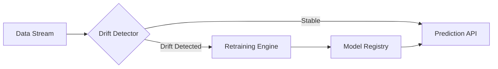

# Self-Healing MLOps System for Customer Churn Prediction

A production-grade MLOps project that predicts customer churn while continuously monitoring its own performance.
When data drift is detected, the system automatically retrains the model and deploys a new version without downtime.

This project demonstrates an end-to-end, self-healing machine learning lifecycle suitable for real-world production environments.

---

## Overview

This system combines churn prediction, automated monitoring, model versioning, and retraining into a single cohesive workflow.

Core capabilities:
- Real-time churn prediction
- Statistical drift detection on live data
- Automatic model retraining and deployment
- Built-in explainability for model decisions

---

## System Architecture



---

## Key Features

### Production Model Registry
- Local artifact-based model versioning
- Models stored as:
  - model_v1.joblib
  - model_v2.joblib
- Metadata stored in JSON for traceability

### Automated Drift Detection
- Uses Evidently AI for data drift monitoring
- Compares production traffic with training data
- Statistical tests include:
  - Kolmogorov-Smirnov (KS) Test

### Auto-Retraining Pipeline
- Automatically triggers retraining when drift is detected
- Ingests new data and retrains an XGBoost model
- Seamless hot-swap of production models with zero downtime

### Explainable AI (XAI)
- SHAP for global and local explanations
- LIME for instance-level interpretability
- Helps build trust and debug model behavior

---

## Project Structure

```bash
├── app.py                  # Streamlit dashboard entry point
├── src/
│   ├── mlops_engine.py     # Retraining logic and model registry
│   ├── monitoring.py       # Drift detection using Evidently AI
│   └── ml_logic.py         # Model training and inference logic
├── models/                 # Model artifacts and metadata
│   ├── model_v1.joblib
│   └── registry.json
├── data/                   # Training and simulated production data
├── requirements.txt
└── README.md
```

---

## Setup Instructions

### Install Dependencies

```bash
pip install -r requirements.txt
```

### Run the Application

```bash
streamlit run app.py
```

---

## Simulating the MLOps Workflow

1. Open the Streamlit dashboard
2. From the sidebar, select Drifted (High Churn)
3. Click Generate Traffic
4. Navigate to the Drift Monitor tab
5. Click Run Check to observe drift detection
6. Go to the MLOps Pipeline tab
7. Click Trigger Retraining

The production model version updates automatically once retraining completes.

---

## Dashboard Features

- Live churn prediction
- Drift status monitoring with alerts
- Model version tracking
- SHAP and LIME visualizations
- Manual retraining triggers for experimentation

---

## Tech Stack

- Python
- Streamlit
- XGBoost
- Evidently AI
- SHAP
- LIME
- Joblib
- Scikit-learn

---

## Use Cases

- Customer churn prediction systems
- Continuous ML deployment pipelines
- MLOps experimentation and education
- Model monitoring and governance demos

---

## Future Improvements

- CI/CD integration for model promotion
- Online learning support
- Cloud-based model registry
- Feature-level drift attribution
- Alerting via Slack or email
