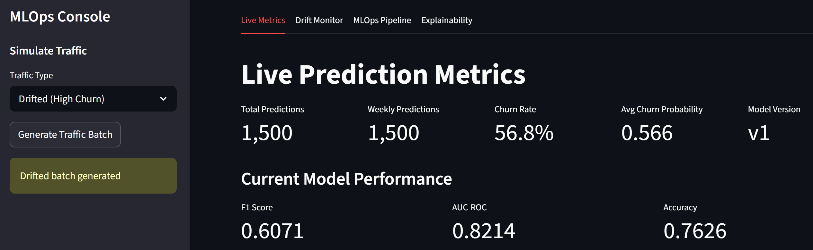
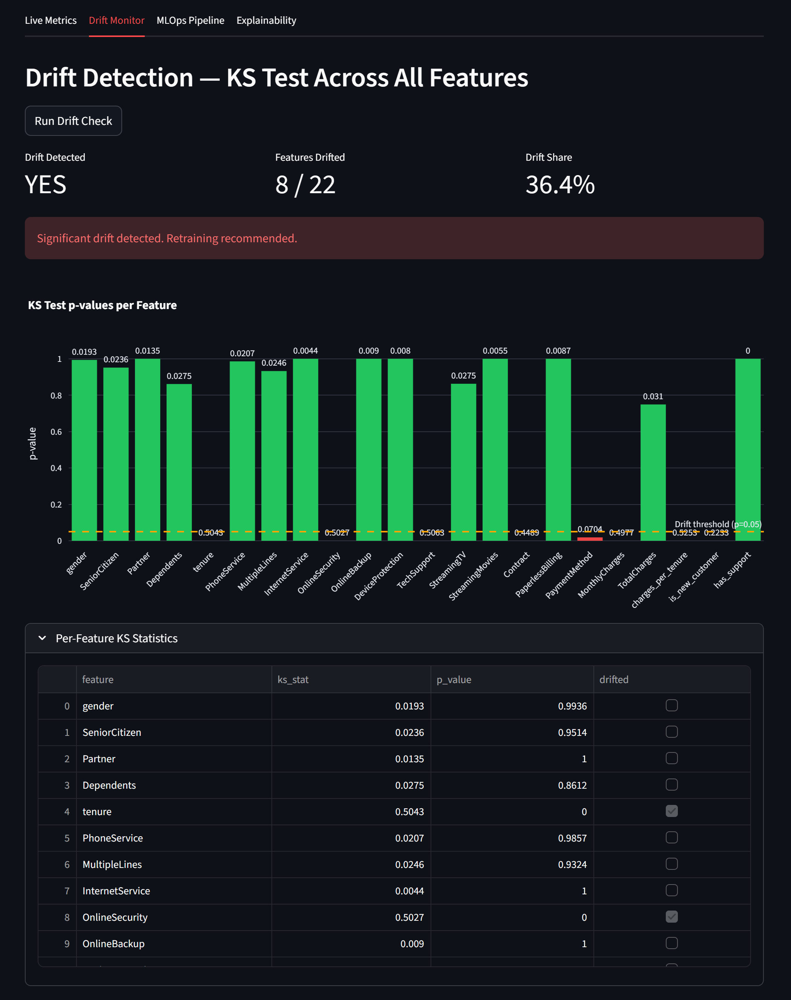
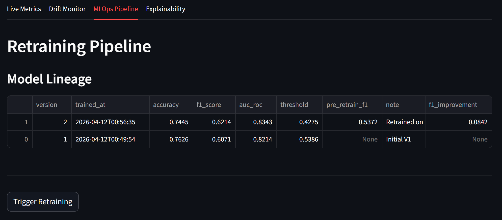
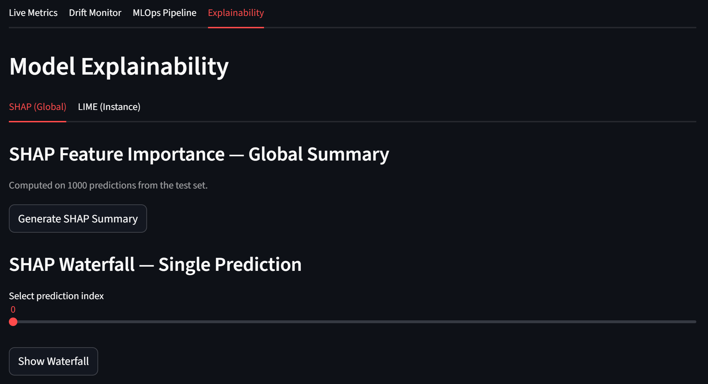

# Customer Churn MLOps Pipeline

A production-grade MLOps system that predicts telecom customer churn, monitors data drift, and automatically retrains when distribution shift is detected.

---

## Key Features

- XGBoost classifier with threshold-optimised predictions
- KS drift detection across 19 features with per-feature p-value reporting
- Automated retraining pipeline with before/after F1 tracking
- SHAP global explanations and LIME instance-level explanations
- Prediction logging with live metrics dashboard

---

## Stack

`Python` · `Streamlit` · `XGBoost` · `Scikit-learn` · `SHAP` · `LIME` · `SciPy` · `Plotly` · `Pandas`

---

## Setup

```bash
pip install -r requirements.txt
```

Download the [Telco Customer Churn dataset](https://www.kaggle.com/datasets/blastchar/telco-customer-churn) from Kaggle and place it at:

```
data/reference_data.csv
```

Run the dashboard:

```bash
streamlit run app.py
```

The model registry and `models/` directory are created automatically on first run.

---

## Project Structure

```
├── data/
│   ├── reference_data.csv
│   └── prediction_log.csv
├── src/
│   ├── explainability.py
│   ├── ml_logic.py
│   ├── mlops_engine.py
│   ├── monitoring.py
│   └── prediction_logger.py
├── models/
│   ├── model_v1.joblib
│   └── registry.json
├── app.py
├── requirements.txt
└── README.md
```

---

## Screenshots

| Live Metrics | Drift Monitor |
|-------------|--------------|
|  |  |

| MLOps Pipeline | Explainability |
|----------------|----------------|
|  |  |

---

## Dashboard Tabs

- **Live Metrics** — total predictions, weekly count, churn rate, avg probability, model version
- **Drift Monitor** — KS test results per feature with drift threshold visualisation
- **MLOps Pipeline** — model lineage table with F1 improvement tracking across versions
- **Explainability** — SHAP summary and waterfall plots, LIME instance explanations

---

## Simulating the MLOps Workflow

1. Select a traffic type from the sidebar (Normal / Drifted)
2. Click **Generate Traffic Batch**
3. Go to **Drift Monitor** and click **Run Drift Check**
4. Go to **MLOps Pipeline** and click **Trigger Retraining**
5. Observe the new model version promoted to production with updated metrics
